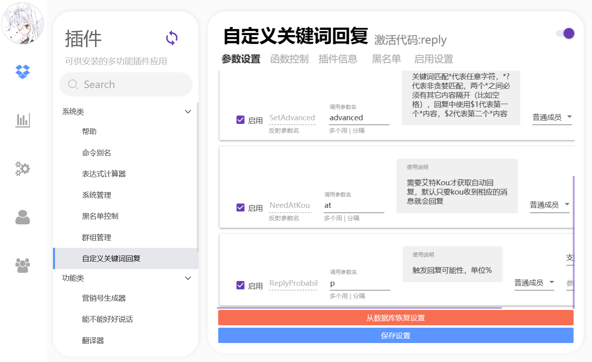
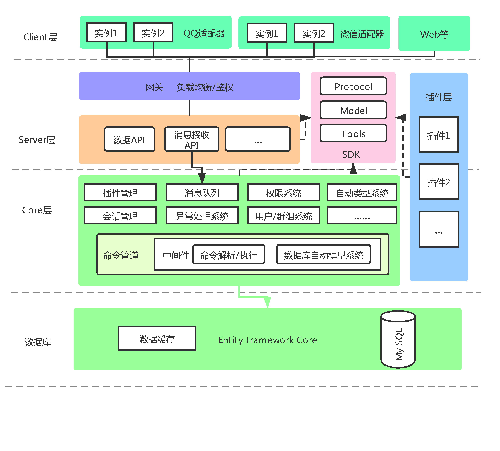

# KouBot 插件开发（开发规范）

欢迎贡献插件，进行pull request即可。（部分系统仍在开发中，现在可以提前开发插件，并使用机器人）

目前暂未开放服务端下载，适配器已适配了QQ平台（Mirai）、Telegram、WeChat。未来将会开放相应服务端+平台适配器微服务程序下载，在自己的服务器启动上并选用安装所需要的插件，就可以得到属于自己的机器人了。


## 简介

[Koubot博客地址](https://koubot.xyz)

博客中有关于框架的详细介绍、设计和原理文档

Koubot是基于.NET（C#）的跨平台插件式聊天机器人框架，支持多平台多机器人自定义插件

插件管理客户端展示：



Koubot基础架构展示：




## 开发教程

~~可能是最容易开发插件的框架~~

以命令中的插件、功能、参数名映射到插件类、方法、属性的思想进行开发。

VS新建一个.NET 5类库项目（编译出来是.dll），从nuget上搜索Koubot，引用Koubot.SDK。

新建一个插件类（也是调用命令的入口，可以看作是命令映射类，因为命令实际上是对于插件的映射：命令中的插件是类，功能是方法，参数是属性）

> **命名空间**规范是要按照插件类别进行命名
>
> KouFunctionPlugin：功能类插件
>
> KouGamePlugin：游戏类插件
>
> 需要用到数据库以及Model的，模型类命名空间规范为KouXXXPlugin.插件名.Models
>


首先插件类继承`KouPlugin`基类

> 插件扩展功能可以使用IWantXXX类的接口，详见SDK提供的接口章节。

然后写出插件可能带有的属性、方法，并在类（必须）、属性、方法、方法参数上打上对应的映射特性标签（插件对应类、属性对应参数、功能对应方法），然后实现方法即可，返回值即为命令调用内容。

> 特性标签有很多设置可供使用，详见SDK文档中的映射特性标签，或直接使用IDE，会有详细提示。
>


### 简易例子

如果要实现命令`/cal add 5 10`或`/cal a 5 10`返回结果为15

```c#
	[KouPluginClass("cal", "计算器")]//设置插件激活名为cal
    public class KouCalculator : KouPlugin
    {
		[KouPluginFunction(ActivateKeyword = "add|a")]//设置功能激活名为add或a
        public int KouAddAlias(int a, int b)//接收两个整型参数（自动转换输入的stirng到int）
        {
           return a + b;
        }

        [KouPluginFunction(Help = "默认功能，如果/cal str str，则'str str'会传入该方法")]
        public override object Default(string str = null)
        {
           return new EventPluginHelp();//返回自动生成的插件帮助
        }
        
    }
```

那么现在就拥有了可以实现上面要求的插件。因为[KouType系统](#支持的自动类型（KouType）)的原因，甚至还可以`/cal a ln(e) 壹佰一十三`，结果为114。

如果想设置为默认方法，直接使用`/a 1 1`来代表计算1+1，也可以这也写（改名Default）（不建议）：

```c#
[KouPluginClass("a", "加法")]
    public class KouAdd : KouPlugin
    {
		[KouPluginFunction(Help = "目前只能有一个默认功能帮助")]
        public int Default(int a, int b)
        {
           return a + b;
        }

        
        public override object Default(string str = null)
        {
           return new EventPluginHelp();//返回自动生成的插件帮助
        }
        
    }
```

一般开发后的插件命令都与alias插件（命令别名）进行配合，将其变得更容易调用，甚至可以通过alias插件设置正则表达式，能够使用自然语言式的调用。

> 可以设置私人alias、群组alias与全局alias。（具体看使用文档）

写好的插件还支持各种内置参数，如自动生成相应帮助的`/cal add --help` 、延时10分钟执行1+1`/cal add 1 1 --sleep 10min` （详见[Koubot使用文档](Koubot使用文档.md)的内置参数章节）


### 复杂例子

以自定义回复系统插件举例（系统插件与外部插件开发无什么区别）

> 该插件使用实例见使用文档-命令机制-举例，以下面这条命令对照，即可发现端倪！
>
> `/reply add *抽签* 恭喜 -group -p 20 -advanced` 

```c#
	[KouPluginClass("reply", "自定义关键词回复",
        Introduction = "（系统插件）自定义关键词回复",
        Author = "7zou",
        PluginType = PluginType.System)]
    public class KouCustomizedKeywordReply : KouPlugin, IWantKouCommand, IWantCommandLifeKouContext
    {
        [KouPluginParameter(
            ActivateKeyword = "global",
            Name = "设置为全局",
            Authority = Authority.BotManager)]
        public bool SetGlobal { get; set; }
        
        [KouPluginParameter(
            ActivateKeyword = "group",
            Name = "设置为群组")]
        public bool SetGroup { get; set; }
        
        [KouPluginParameter(
            ActivateKeyword = "advanced",
            Name = "使用正则语法",
            Help = "关键词匹配*代表任意字符，*?代表非贪婪匹配，两个*之间必须有其它内容隔开（比如空格），回复中使用$1代表第一个*内容，$2代表第二个*内容")]
        public bool SetAdvanced { get; set; }
        
        [KouPluginParameter(
            ActivateKeyword = "at",
            Name = "需要艾特Kou才获取自动回复",
            Help = "需要艾特Kou才获取自动回复，默认只要kou收到相应的消息就会回复")]
        public bool NeedAtKou { get; set; }
        
        [KouPluginParameter(
            ActivateKeyword = "p",
            Name = "回复可能性%",
            Help = "触发回复可能性，单位%，范围(0.01,100)",
            NumberMax = 100,
            NumberMin = 0.01,
            EnableDefaultNumberRangeError = true)]
        public double? ReplyProbability { get; set; }
        
        
        #region 插件方法
        [KouPluginFunction(
            ActivateKeyword = "增加|add",
            Name = "增加自定义回复",
            Help = "成功返回增加的自定义回复信息",
            SupportedParameters = new[] {nameof(SetGlobal), nameof(SetGroup), nameof(NeedAtKou), nameof(SetAdvanced), nameof(ReplyProbability)})]//绑定支持的参数这样生成帮助的时候会更详细
        public object KouAddAlias(
            [KouPluginArgument(Name = "关键字")] string keyword,
            [KouPluginArgument(Name = "回复语")] string reply)
        {
           ...
        }

        [KouPluginFunction(
            ActivateKeyword = "删除|delete", 
            Name = "删除自定义回复", 
            Help = "接受自定义回复ID，成功将返回所删除的自定义回复信息")]
        public string KouDeleteAlias(
            [KouPluginArgument(
                Name = "自定义回复ID", 
                CustomErrorReply = "删除自定义回复失败，ID输入错误")]
            List<int> replyIDs)
        {
            ...
        }

        [KouPluginFunction(
            Name = "自定义回复默认功能",
            Help = "不写参数获取所有支持的自定义回复\n给自定义回复ID返回其详细\n给自定义回复返回原始命令")]
        public override object Default(string str = null)
        {
           ...
        }

...
        #endregion


        public KouCommand Command { get; set; }
        public KouContext KouContext { get; set; }
    }
```

可以发现，属性类型、方法参数类型直接使用[KouType系统](#支持的自动类型（KouType）)中支持转换的类型即可，可以使用对应的标签特性进行更为详细的设置。

插件的返回值即是命令调用的结果。目前支持的返回类型有KouMessage、string、以及一些事件（Event开头）等。

> 使用IWantXXXX类型接口拓展后，可以有更为丰富的功能，比如获取来源群组、用户，这些自带的系统类中也封装了很多方法。


### 使用数据库

#### 使用数据库自动模型系统

不需要自己建表，只需要按照EFCore的规范写模型类，然后在模型类上加上KouAutoModelTable特性标签，在所需要启用全自动模型功能的字段属性上加上KouAutoModelField特性标签即可。

注意数据库表名规范是`plugin_插件缩写_表缩写`

罗马音助手中谐音表示例：

```c#
	[KouAutoModelTable(
	"list", //意思是表激活名为list
	new[] { nameof(KouRomajiHelper) },//意思是绑定的插件类，假设插件激活名为romaji，那么该表的入口命令即为/romaji.list
    Name = "罗马音-中文谐音表")]
    [Table("plugin_romaji_pair")]
    public partial class PluginRomajiPair : KouAutoModel<PluginRomajiPair>
    {
        [Column("id")]
        [KouAutoModelField(
            IsPrimaryKey = true,
            UnsupportedActions = AutoModelActions.Add | AutoModelActions.Modify)]
        public int Id { get; set; }
        
        [Column("romaji_key")]
        [StringLength(20)]
        [KouAutoModelField(
            ActivateKeyword = "romaji|罗马音",
            Name = "罗马音名",
            Features = AutoModelFieldFeatures.RequiredAdd,
            CandidateKey = MultiCandidateKey.FirstCandidateKey)]
        public string RomajiKey { get; set; }
        
        [Column("zh_value")]
        [StringLength(20)]
        [KouAutoModelField(
            ActivateKeyword = "zh|中文",
            Name = "中文谐音",
            Features = AutoModelFieldFeatures.RequiredAdd)]
        public string ZhValue { get; set; }

        //这里的格式化，formatTpye中有Brief（多条简略），Detail（单条详细）与其他自定义等，用于比如自动分页系统中的自动结果格式化。
        public override string ToString(FormatType formatType, object supplement = null)
        {
            return $"{Id}.{RomajiKey} - {ZhValue}";
        }

		//这里是EFCore安装模型的逻辑，一般使用特性标签即可，某些没有提供特性标签的，需要使用该流式API进行设置，教程具体详见EFCore官方文档或数据库文档
        public override Action<EntityTypeBuilder<PluginRomajiPair>> ModelSetup()
        {
            return entity =>
            {
                entity.HasIndex(e => e.RomajiKey)
                    .HasName("romaji_key")
                    .IsUnique();
            };
        }
    }
```

##### 全自动型

如果按以上示例配置自动好后，现在的表已经支持条件复杂查询、以及带权限控制、候选键/必填约束等功能的增删改了。

##### 半自动型

除了全自动数据库自动模型外，还有可以主动的去进行数据库的增删改查，类似于EFCore的使用方式，并在其基础上进行了二次封装，带入了缓存+锁的技术，不需要自己再管理缓存与多线程锁了，而且，提供了较原来EFCore更为方便的API，更高效率的开发。

譬如自定义回复插件中，使用半自动型数据库自动模型系统找到并删除指定自定义回复，可以发现不需要使用DbContext，也不需要自己控制缓存操作了。提供Delete、Add、Modify、Find、FindThis、ModifyThis等等API，还提供错误失败后的详细错误信息等（数据库自动模型使用了Kou异常处理系统，所以可以非常方便的获取错误与异常），数据库控制较EFCore使用方式更加方便。

```c#
	SystemCustomizedKeywordReplyList model = new SystemCustomizedKeywordReplyList();
			if(!model.HasExisted(p => p.KeywordId == id, out var needDeletedItem))
                {
                    result.Append($"找不到ID{id}的自定义回复\n");
                    continue;
                }
				//...其他逻辑省略
                if (!model.Delete(p => p.KeywordId == id, out var deletedItem))
                {
                    result.Append($"ID{id}删除失败，{model.ToErrorString()}\n");
                    continue;
                }
```


### 支持的自动类型（KouType）

即自动将用户的输入（string）转换成对应的实际类型，插件作者不需要处理传入的string了

插件作者编写插件可以使用KouType中支持的**实际类型**来声明插件参数（即属性）、插件功能参数（即插件类的方法里的参数）。KouType支持的功能很多，且不断优化中，目前除特殊类型外，均内容正则限制、转换类型出错自定义报错语句等等功能。


| KouType类型               | 实际类型                                                     | 效果及提示                                                   |
| ------------------------- | ------------------------------------------------------------ | ------------------------------------------------------------ |
| KouInt 整数               | int、int?                                                    | 支持中文以及单位甚至表达式。<br/>比如：壹佰；500；1k、1w；一万；(sin(pi/2)^e\*100+14)*1000+五百一十肆 等等。 |
| KouBool  布尔类型         | bool、bool?                                                  | 支持多种方式转换为bool。插件参数如果使用默认为true，不使用为false或null（bool?类型）<br/>比如-group 参数，只要用上，默认是将参数group赋值为true。 |
| KouEnum 枚举              | 给定的Enum类                                                 | 将string自动转换为对应Enum中的枚举，使用KouEnumName可以扩展string转Enum的方式 |
| KouDouble 浮点数          | double、double?                                              | 与Kou型整数一样，只是不会截断小数部分结果了。                |
| KouString 字符串          | string                                                       | 即用户输入的纯字符串，注意某些地方可以支持正则输入（比如数据库自动模型搜索功能、alias插件、自定义回复插件），输入原始正则可以使用`r(xxxx)`，其中xxx为正则表达式 |
| KouTimeSpan 时间间隔      | TimeSpan、TimeSpan?                                          | 支持各种单位，支持输入datetime格式自动转换为到当前时间的时间间隔。<br/>比如：一炷香（30分钟），一小时，1h5m（一小时五分钟），1:00（1分钟）,50（50秒），后天早上八点（自动计算当前到后天早上八点距离）等等 |
| KouPlatformUser 平台用户  | PlatformUser                                                 | 能够将用户@的（即消息中的Target对象List，需要适配器实现转换）传入，多个则按顺序获取；<br/>最终设想的效果是：用户可以输入平台用户id或用户名、如果有重复的会自动进行会话询问是哪一个。另外可能会提供一个--try内置参数（某些重要决定可以提供事前确认）能够让用户进行确认选择，就是只查到一个用户，也会通过会话来进行确认 |
| KouPlatformGroup 平台群组 | PlatformGroup                                                | 可以使用kou中群组设定的群组昵称，也可以使用平台群组id号（如QQ群组号） |
| KouIEnumerable\<T\>       | 所有**上面**支持的类型的**实际类型**的ICollection类（比如List等）以及Queue、Stack等 | 支持用户的多个输入自动转换为list，支持个数限制、自定义分割字符 |

> string扩展：自行拓展的简易正则可以用`a*`代表以a开头，`*b`代表以b结尾，`*c*`代表包含c`a*?b*`代表以a开头后中间有任意字符（?是非贪婪）然后接一个b，再接任意字符，非贪婪与贪婪的不一样之处在于，如果是`a*b*`，对于a嗨b呀b，第一个*将会收集到`嗨b呀`，第二个\*收集到空，而`a*?b*`，第一个\*收集到的是`嗨`，第二个\*收集到的是`呀b`。
>
> 其中另外alias插件中还可使用正则替换，详见alias插件帮助。 


### 使用Kou会话（KouSession）服务

用户或群组能与插件、以及系统内部建立一个临时的会话，用户不必再输入激活关键字，而且每次输入会使得系统或插件的状态变化（存在状态保留，而不是一条语句执行结束）

会话分用户会话和群组会话。用户会话一旦建立，用户机器人账号所绑定的所有平台账号共用一个会话进度，假设有一个场景，用户想获取某个平台上的资源，转发比较困难，如果用户先在一个平台开启一个会话，然后用户切换到需要获取资源的平台进行发送，最终Kou也能完成一个插件的会话调用。

群组会话顾名思义任何群组的人说话都可以对其有反应。

#### 使用方式

插件类需要实现`IWantKouSession`接口，这样插件类在调用时会注入会话服务实例，插件作者直接使用即可；

比如，该接口提供的会话服务实例属性名为`SessionService`，在所需要的地方直接使用即可，提供多种API，比如最直接的Ask，即获取用户下一次纯字符串输入；另外如果会话要对所有群组内成员有效，则需要使用AskGroup。另外会话内置了使用KouType系统，因此可以使用泛型Ask\<T\>，其中T为KouType中支持的类型，这样将会自动转换用户下一次输入到该类型。会话还有多种设置，在编写时利用ide查看即可，注释非常详细。

```c#
			
			var firstInput = SessionService.Ask("你好", s =>
            {
                s.CloseReply = new KouMessage("会话已经自动关闭");//可以自定义会话关闭回复
            }).Content;
            if (firstInput == "b")
            {
                var secondInput = SessionService.Ask("你说的是什么呢？").Content;
            }
```

### 插件调试

调试类库项目需要再新建一个控制台项目，然后引用你写的插件类库项目，实例化插件对象，然后传入参数进行单元测试。

数据库暂时只能模拟数据调试。


## .NET 5.0注意事项

默认build出来的bin文件夹里面会有一个ref文件夹，里面的dll无法被Core引用用于插件装载。该dll是用来提升build速度的，但若没有项目引用它这个reference assemblies特性就没什么用了。所以写插件可以关掉此特性，在projectfile中（写在PropertyGroup中）写	

```xml
<!--
Turns off reference assembly generation
See: https://docs.microsoft.com/en-us/dotnet/standard/assembly/reference-assemblies
-->
<ProduceReferenceAssembly>false</ProduceReferenceAssembly>
```


## 鸣谢/引用

[miraiQQ 机器人](https://github.com/mamoe/mirai)

[「能不能好好说话？」拼音首字母缩写翻译工具](https://github.com/itorr/nbnhhsh)